<div align="center">

<!-- ═══════════════════ BOOT SEQUENCE ═══════════════════ -->

<a href="https://github.com/nnish16">
  
</a>

<br/><br/>

<!-- ═══════════════════ STATUS ARRAY ═══════════════════ -->

<a href="https://github.com/nnish16">
  
</a>
&nbsp;

&nbsp;


</div>

<br/>

```yaml
# ╔═══════════════════════════════════════════════╗
# ║         nish.sys — identity manifest          ║
# ╚═══════════════════════════════════════════════╝

identity:
  handle: nnish16
  role: Full-Stack Engineer

runtime:
  languages: [TypeScript, Python, Go]
  domains: [AI/ML Systems, Distributed Architecture, Open Source]

quirks:
  this_profile: "morphs 3× daily, autonomously"
  coffee_protocol: "while (awake) { code(); sip(); }"
  philosophy: "Ship fast. Learn faster."
```

<br/>

<div align="center">

<!-- ═══════════════════ VIEWPORT HEADER ═══════════════════ -->


<br/>
<sub>⟡ morphs autonomously — <b>dawn</b>: metrics · <b>noon</b>: snake · <b>dusk</b>: shooter ⟡</sub>

</div>

<br/>

<!-- START_VISUAL -->

<!-- END_VISUAL -->

<br/>

<div align="center">

<!-- ═══════════════════ NEURAL STACK ═══════════════════ -->


<br/><br/>


</div>

<br/>

<div align="center">

<!-- ═══════════════════ SYSTEM LOGS ═══════════════════ -->

<details>
<summary><kbd>&nbsp;◈ SYSTEM LOGS ◈&nbsp;</kbd></summary>

<br/>

| Phase | Schedule (EST) | Visual | Engine |
|:---:|:---:|:---:|:---:|
| `🌅 DAWN` | 08:00 | `metrics.svg` | [lowlighter/metrics](https://github.com/lowlighter/metrics) |
| `🐍 NOON` | 14:00 | `snake.svg` | [Platane/snk](https://github.com/Platane/snk) |
| `🚀 DUSK` | 20:00 | `shooter.gif` | [gh-space-shooter](https://github.com/czl9707/gh-space-shooter) |

<sub>Each phase overwrites the viewport above. The profile is never the same twice.</sub>

</details>

</div>

<br/>

---

<div align="center">
  <sub>⟡ This profile is a living system. It morphs 3× daily via <a href="https://github.com/nnish16/nnish16/actions">GitHub Actions</a>. No two visits are the same. ⟡</sub>
</div>
